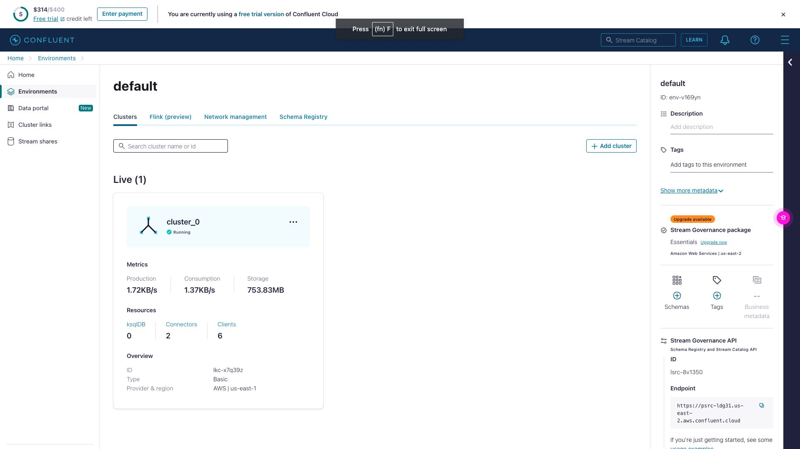
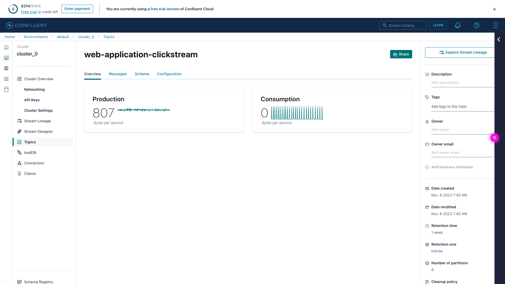
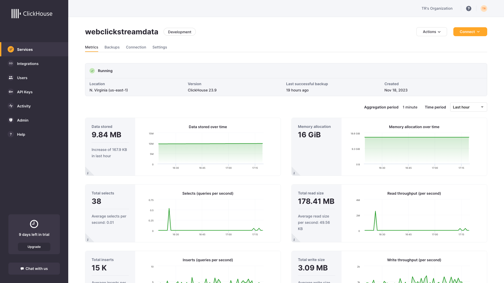
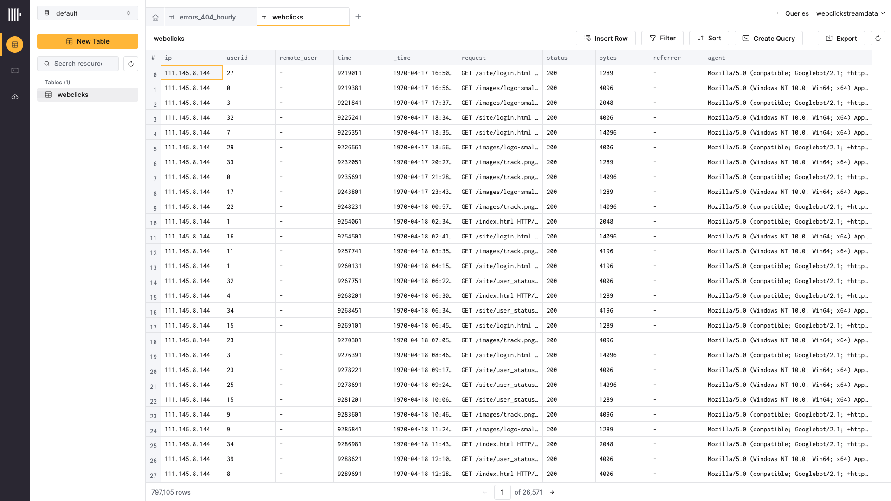
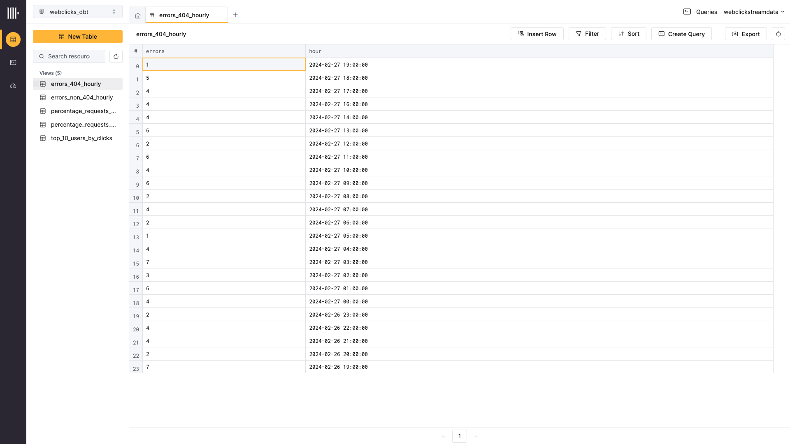
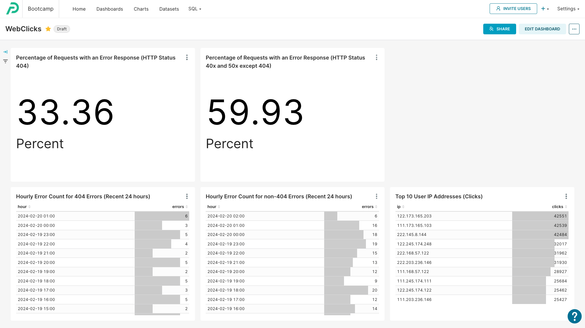

# Project Implementation Description
1. The *Confluent Datagen - Clickstreaming* data source continuously populates the web-application-clickstream Kafka Topic with web application traffic data.
2. The Confluent HTTP Sink (*clickhouse-webclicks*) writes the topic data to the Clickhouse *default.webclicks* table.
3. Clickhouse Views are generated by dbt automation. The dbt automation includes tests for expected values (ex: non-null values, percentages between 0 and 100 inclusive, etc.)
4. A Preset dataset is created for each of the Clickhouse Views.
5. A Preset Dashboard is created from each of the datasets.
# Screenshots
## Confluent Cloud
### Environment View

### Kafka Topic

## Clickhouse
### Service View

### Data Sink Results View

### dbt-Generated Model Views

## Preset
### Webclicks Analytics Dashboard
