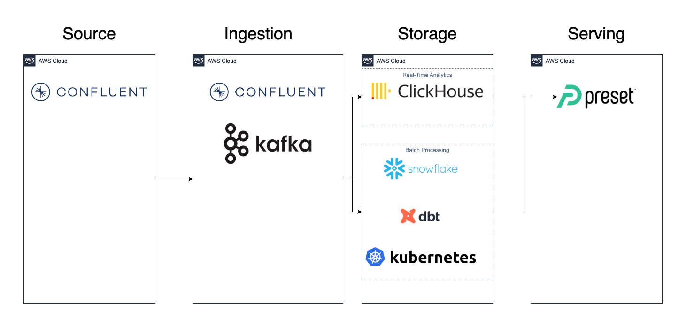

# Project plan 

## Objective 
The objective of this project is to provide meaningful reports from real-time web application clickstream data. 

## Consumers 
The users of our datasets are Data Analysts, Product Managers, and Software Developers. They want to access our data via curated serving tables and via dashboards.

## Questions 
> - What is the hourly amount of errors not related to content not found (404) errors?
> - What is the hourly amount of errors due to content not found (404) errors?
> - What percentage of requests are successful?
> - What percentage of requests end in errors not related to content not found (404) status codes?
> - What percentage of requests end in errors that are related to content not found (404) status codes?
> - Which are the top 10 IP addresses using the site determined by total number of clicks? 

## Source datasets 
| Source name | Source type | Source documentation |
| - | - | - |
| Confluent Datagen - Clickstreaming | Stream | - | 

## Solution architecture

